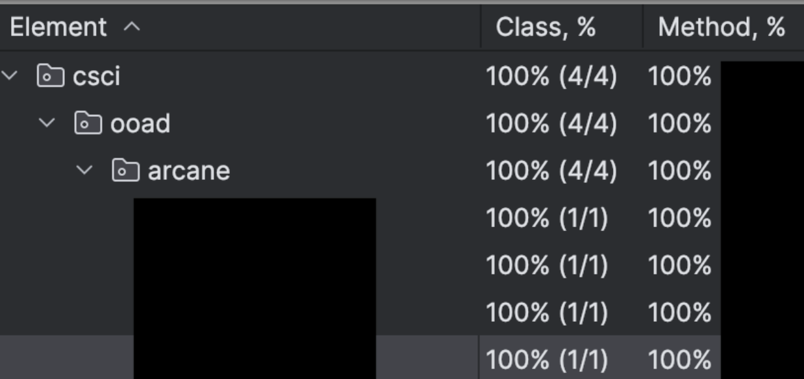

# CSCI 4448/5448 - Fall 2024 - Homework 2

**Value: 50 Points**

The purpose of this homework is to start our adventure game, which we will use as a vehicle for 
the entire semester. Our game will start simple and become more and more sophisticated. Here, we 
are concentrating on OO design, learning Java, and getting into the rhythm of developing code as
a team in a Test-Driven manner. 

Put all team members' names here:

    Name: Your Names Here

For all code submissions, the following will be required:

* The project builds with Gradle and runs successfully
* The code has meaningful names for everything: variables, methods, classes, interfaces, etc. (1% off for each bad name, up to 10% total)
* The project has unit tests with 100% method coverage. This does not mean you need a separate test for each 
method, but if you have no test that calls a method…why did you write that method?
* This README.md file describing the details of your implementation

For this assignment, you need to also do the following:

* Include two text files with the contents of your output run. Each text file shows a complete game. They should look different, since there is randomness in this game.
* A screenshot of your test coverage from your IDE (IntelliJ makes this easy - just run your tests with coverage). It should look something like this:


This is a group assignment, as will be all the remaining homework assignments. 
You will submit a URL to your GitHub Classroom repository.

# Polymorphia: An OOP Saga

This homework is the first of many where we'll be building a self-playing (initially) 
game called **Object-Oriented Obsession**.  

We’ll be building up this project gradually, with the patterns we learn in class. 
For this assignment, we create a very minimal version.

In Polymorphia, our Adventurer stumbles upon the entrance to a long-lost buried structure (Maze or Cave) that 
consists of a network of interconnected rooms, like this:

```
[Room 1]----[Room 2]
|             |    
|             |    
[Room 3]----[Room 4]
```

In our maze/cave, there exists an Adventurer and a Creature. These should be randomly
placed in one of the rooms. Both characters should have the following qualities:

* Name: set at construction
* Health: 5

You are free to add other fields as you see fit to implement the assignment. Use inheritance to 
keep things DRY.

A room might contain an alive Creature and/or an alive Adventurer. 
Assign each to a random room when the maze/cave is constructed. 
Play proceeds like this:

1. If the Adventurer and the Creature are in the same room, they fight.
2. If they are not in the same room, the Adventurer moves to a random neighboring room.
3. That is it for each turn.
4. The game ends when either the Adventurer or the Creature dies.

For each room, if the room contains both the Adventurer and the Creature, then they fight.
If the room only contains the Adventurer they move to a random neighboring room.
If the room is empty or only contains the Creature, nothing happens.

A “fight” occurs like this:

    The Adventurer and the Creature both roll a 6-sided die.
    If they roll the same number, nothing happens and the turn ends.
    If one value is greater than the other, the difference is subtracted from the health of the loser. 
    That ends the turn then.

The game proceeds through multiple turns until either the Adventurer or the Creature wins. 
They win by killing the other. A character dies when their health drops to zero or below.

Hence, if the Adventurer and the Creature are in the same room, they will fight each 
subsequent turn until one of them dies.

When the game is run, it should print out the state of Polymorphia after every turn. 
It should look something like this:

```shell
Starting play...
Polymorphia MAZE: turn 1
Northwest:
Northeast:
Creature Ogre(health: 3) is here
Southwest:
Adventurer Bill(health: 5) is here
Southeast:

Polymorphia MAZE: turn 2
Northwest:
Northeast:
Adventurer Bill(health: 5) is here
Creature Ogre(health: 3) is here
Southwest:
Southeast:

Polymorphia MAZE: turn 3
Northwest:
Northeast:
Adventurer Bill(health: 5) is here
Creature Ogre(health: 2) is here
Southwest:
Southeast:

Polymorphia MAZE: turn 4
Northwest:
Northeast:
Adventurer Bill(health: 0) is here
Creature Ogre(health: 2) is here
Southwest:
Southeast:

Boo, the Creature won!
```

Some of the classes you *might* create are the following (you can use these names or your own names):

- Polymorphia
- Maze/Cave
- Room
- Adventurer
- Creature
- Dice

You are free to create any classes you see fit. In general, each class will have a corresponding test class
in the src/test/java directory and in the same package as the source class. This test class should be named
in this format:

    <SourceClassName>Test

    example: RoomTest

One test is given for you, though it does not compile. It defines
the top-level class (Polymorphia) and two methods that must be implemented to get the test to pass. 
You are free to change the constructor call, but the other two lines should be left unchanged. 
This test will be how you'll run the game. There is no need for a *main* method. For right now and 
in the next few homeworks, we'll be running this game from tests only.

# Submission and Grading
The submission will be a URL to the GitHub repository. The repository should contain well-structured OO Java 
code for the Polymorphia simulation, the two captured text files with the program results requested, 
and a README file that has the names of the team members, the Java version, 
and any other comments on the work – including documenting any assumptions or interpretations of the problem. 
Only one URL submission is required per team.

## Rubric
- 5 points for the README file: A README file with names of the team members, the Java version, and any other comments about your implementation or assumptions should be present in the GitHub repo.  
- 15 points for readable OO style code: Code should be commented if necessary, but self-documenting names are preferred.  Include citations (URLs) of any code from external sources. Concentrate on writing cohesive code with minimal coupling.
- 15 points for correctly structured output: Submit the output generated from running your game. Indicate which test was run to produce this output.
- 15 points for the required tests. If possible (easy, if you use IntelliJ) include a screenshot of your code coverage. It should look something like this:

## Github Guidelines
All code submissions for this course will be managed through GitHub Classroom. Kindly generate the GitHub repository for Homework 2 by following this link: [https://classroom.github.com/a/oDfMNF9D](https://classroom.github.com/a/oDfMNF9D)

Since Homework 2 is a team assignment, only one repository submission is required per team. Hence, please do the following:

* TEAM-MEMBER-1 generates the repository.
* TEAM-MEMBER-1 adds TEAM-MEMBER-2 as a collaborator with write permissions.

Either of the two submits the repository link in Canvas.
Please do not make the repositories public since this violates the Honor Code.
Please note that repositories not established using the GitHub Classroom link will not be considered valid for submission. 
Please contact the class staff if you encounter technical difficulties or have questions about the setup process.

## Overall Project Guidelines
Assignments will be accepted late for one day only with a penalty of 10% for each day. 
After two days, assignments will be given a 0 and will not be graded.

Use office hours, e-mail, or Piazza to reach the class staff regarding homework/project questions or if you have issues completing the assignment.

